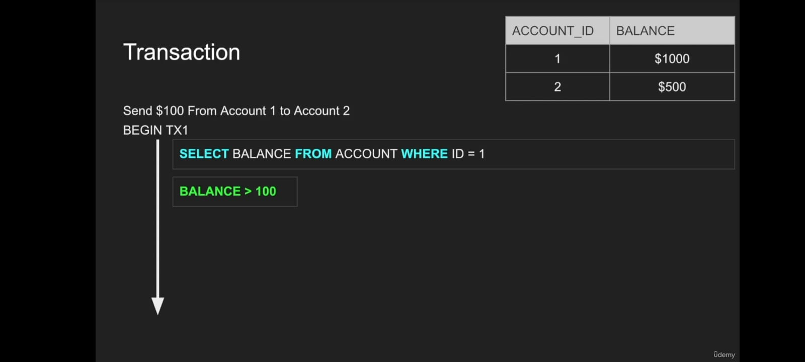
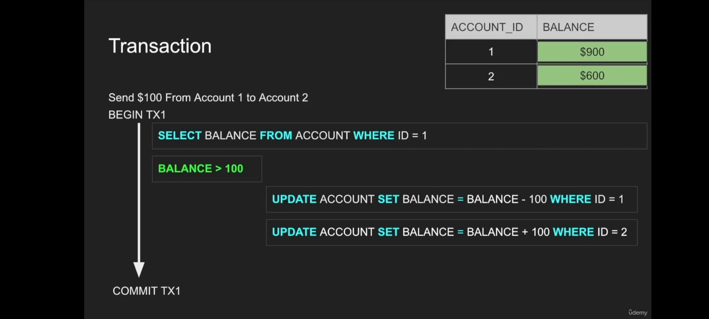

# Transaction

## What is Transaction?
A Transaction is a set of queries executed as a single unit of work, such as an account deposit (consisting of a SELECT, UPDATE, and UPDATE query).

## Transaction Lifespan
1. BEGIN Transaction
2. COMMIT Transaction
3. ROLLBACK Transaction

## COMMIT Methods
1. Fast commit: Changes are persisted to disk as the queries are executed.
2. Slow commit: Changes are written to memory and persisted at the end of the transaction. This method can lead to a crash if the transaction is larger. 
  - Note: ROLLBACK is easier to execute in Slow commit compared to Fast commit.

## Example
-  Postgresql performs Fast commits, which are fast but require a lot of I/O.
-  SQL Server performs slow commits.

## ROLLBACK
In case of unexpected termination (e.g. a crash), a Transaction requires ROLLBACK.

## Characteristics of Transactions
1. Transactions are typically used for modifying data.
2. However, it is common to have transactions that are read-only.

    **Example**: When generating a report, it may be necessary to retrieve a consistent snapshot of the data as it existed at the time of the transaction.

## Transaction Visualization

